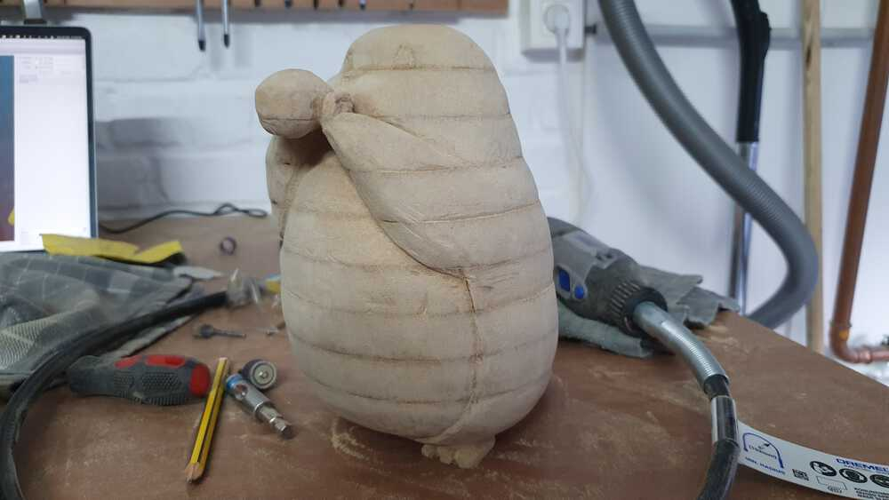
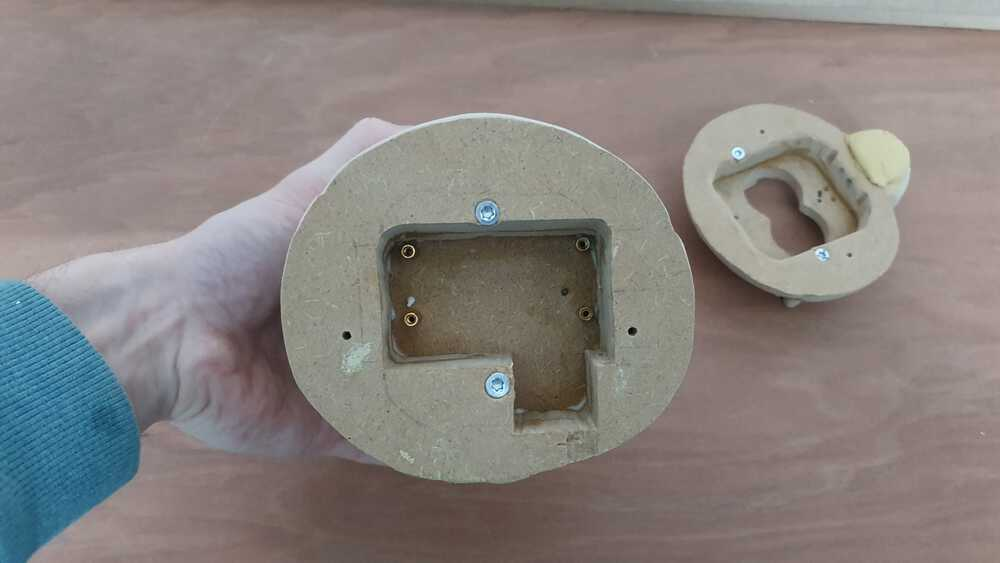
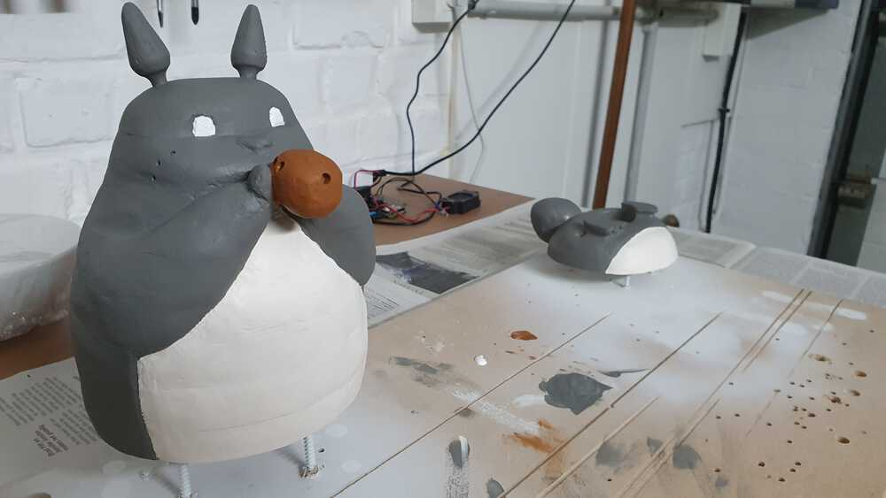
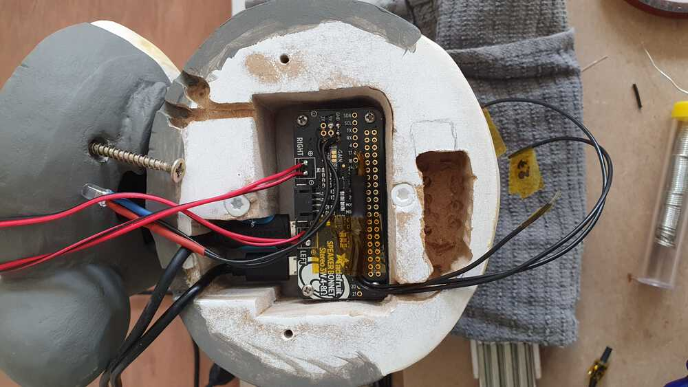

# Totoro Music Box

Made with ♥ by Peter Lowie


* [Requirements](#requirements)
* [Process](#process)
* [Raspberry Pi Setup](#rpisetup)


<span id="requirements"></span>
## Requirements

* ["Totoro Family" 3D Model by PatrickFanart](https://www.myminifactory.com/object/3d-print-totoro-family-105112)
* [Slic3r](https://slic3r.org/) to single out Totoro and slice the 3D Model
* [Raspberry Pi Zero](https://www.raspberrypi.org/products/raspberry-pi-zero/)
* Micro SD Card (UHS Speed Class 1 for faster startup, see ./src/install.sh)
* Micro USB Charget with On/Off Switch
* [Adafruit I2S 3W Stereo Speaker Bonnet](https://www.adafruit.com/product/3346)
* [3W 4Ω Stereo Speaker Set](https://www.amazon.de/gp/product/B0894NY3SZ)
* MDF Panel (for easier sanding), screws, glue, paint, tactile switches, led, low-voltage-cable, resistors,...
* Variety of tools
* Lots of time and patience 😉


<span id="process"></span>
## Process

### 1. Creating the "slices"


### 2. Sanding it down





### 3. Preparing the electronics and internals




### 4. Glueing it all together


### 5. Painting Totoro




### 6. Installation and soldering of the electronics
Using external pull-down resistors as they proved more reliable for long time usage.




### 7. The finished product


<span id="rpisetup"></span>
## Raspberry Pi Setup

``` bash
# Setup sd with barebone raspbian and create "ssh"-file in boot.
# Boot the rpi and ssh into it.

# Use rapi-config to change keyboard-layout and disable serial.
sudo raspi-config

# Install git
sudo apt-get install -y git

# Generate ssh-keys and add it to this repo
ssh-keygen

# Clone repo
git clone git@github.com:LowieHuyghe/totoromusicbox.git
cd totoromusicplayer

# Run i2samp install. Twice!
./src/install/i2samp.sh

# Run install to optimize startup, and setup the service.
./src/install.sh
```
